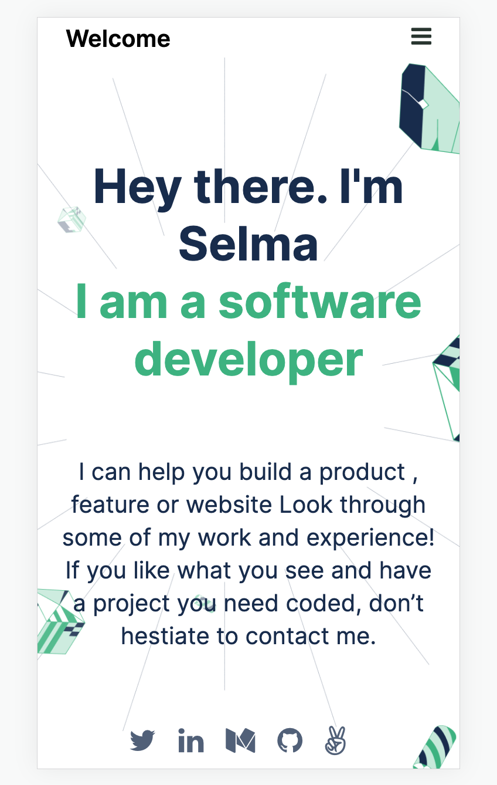

# Portfolio: setup and mobile version skeleton 

> This is my portfolio website showing myself as a web developer. 

## Built With

- HTML
- CSS

To get a local copy up and running follow these simple example steps.

### Prerequisites
- Linters
- GitHub Flow
- Flexbox
- Figma

### Install
- git clone [git@github.com:selma-belhadj/My-1st-Portfolio.git](git@github.com:selma-belhadj/My-1st-Portfolio.git)

- cd My-1st-Portfolio

## Author

👤 **Author**

- GitHub: [@selma-belhadj](https://github.com/selma-belhadj)
- Twitter: [@Bel_Selma16](https://twitter.com/Bel_Selma16)
- LinkedIn: [@selma-belhadj](https://www.linkedin.com/in/selma-belhadj/)

## 🤝 Contributing

Contributions, issues, and feature requests are welcome!

Feel free to check the [issues page](../../issues/).

## Show your support

Give a ⭐️ if you like this project!

## Learn More

You can learn more in the [Set up a "Hello Microverse" project](https://github.com/microverseinc/curriculum-transversal-skills/blob/main/documentation/hello_microverse_project.md)

## 📝 License

This project is [MIT](./MIT.md) licensed.
